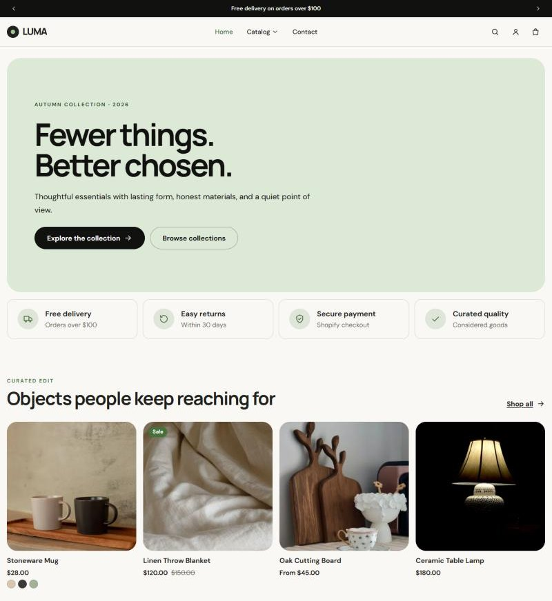
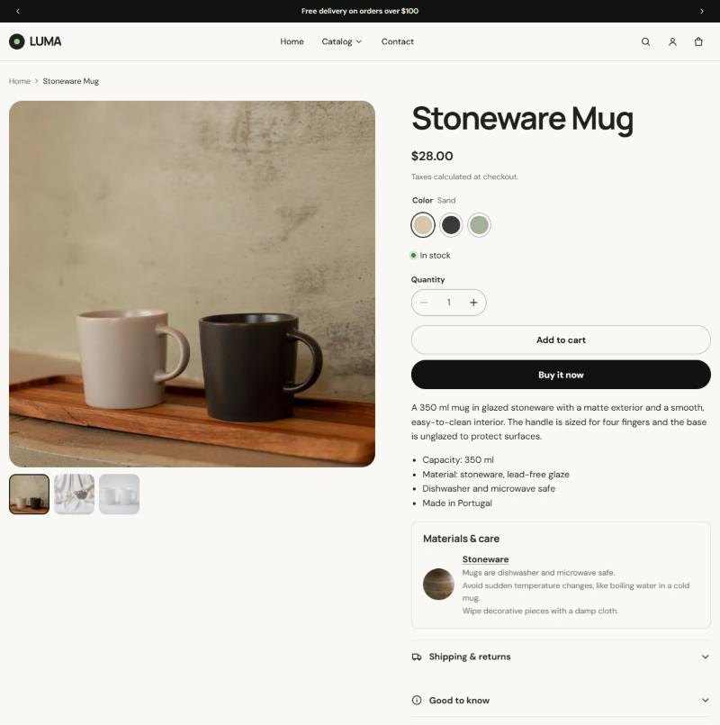
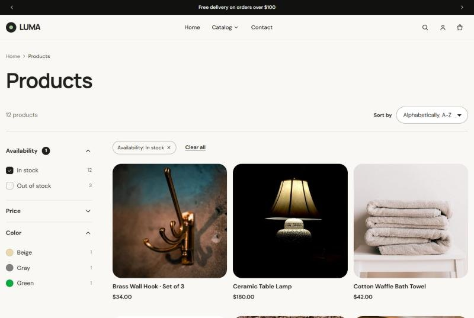
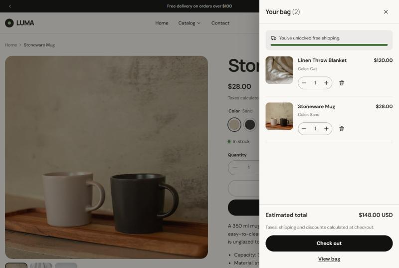
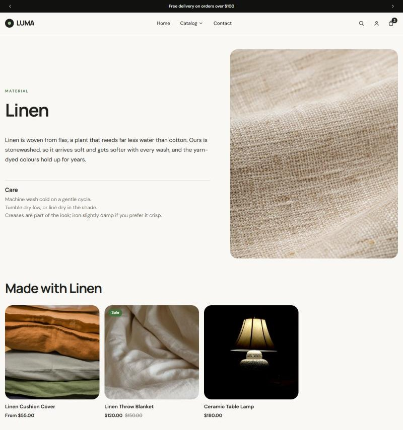
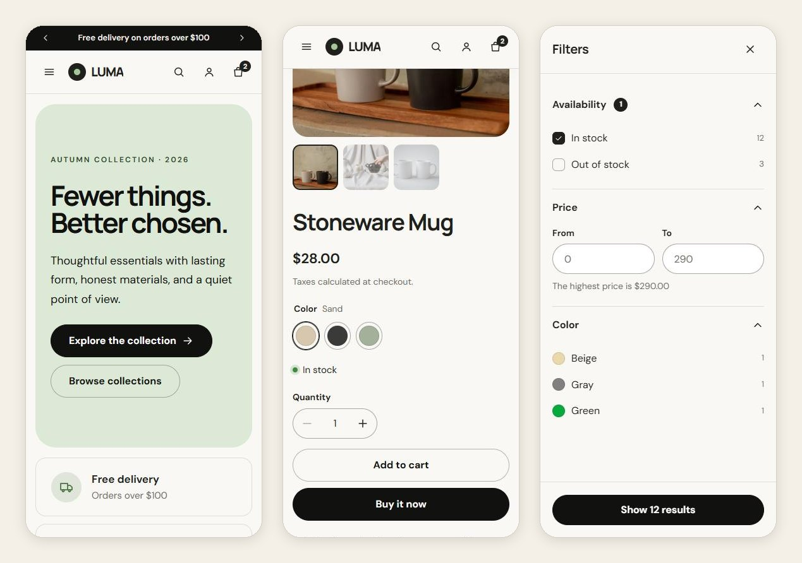

# Luma theme

An Online Store 2.0 Shopify theme written from scratch in Liquid for **Luma**, the same brand as my [headless storefront](https://github.com/GRandow/luma-shopify-storefront). Merchants compose pages from theme blocks in the editor; shoppers get storefront filtering, a variant picker that scales to 2,048 variants, an Ajax cart drawer, predictive search, metaobject content and two languages. No framework, no build step: Liquid, CSS and a few small ES modules.

[](https://github.com/GRandow/luma-theme/actions/workflows/ci.yml)

Theme Check runs with every check enabled (`theme-check:all`) and reports no offenses. All five color schemes pass WCAG AA contrast (`npm run contrast`).

## Live preview

**[Open the theme on the demo store](https://luma-dev-xfj7vgat.myshopify.com/?preview_theme_id=167440023769)** and enter the store password: **`luma`**

It is a Shopify development store, so the password page cannot be removed and no real orders go through. The link previews the theme from the store's theme library, which `npm run push` keeps up to date.

## Screenshots





| Collection with storefront filters                                                              | Ajax cart drawer                                                                          |
| ----------------------------------------------------------------------------------------------- | ----------------------------------------------------------------------------------------- |
|  |  |





## What it shows

| Feature                                     | Where                                                                                                         | How                                                                                                                                                                                                                                                                                                                                     |
| ------------------------------------------- | ------------------------------------------------------------------------------------------------------------- | --------------------------------------------------------------------------------------------------------------------------------------------------------------------------------------------------------------------------------------------------------------------------------------------------------------------------------------- |
| Theme blocks and presets                    | `blocks/`, `sections/section.liquid`                                                                          | Sections accept `@theme` and `@app` blocks and render them with ``. Groups nest, and presets compose ready-made layouts (benefits row, promo banner, rich text) from the same generic blocks.                                                                                                                 |
| Product page from private blocks            | `sections/main-product.liquid`, `blocks/_*.liquid`                                                            | Title, price, picker, stock, buy buttons and materials are private theme blocks that read `closest.product`, mixed freely with public blocks and app blocks.                                                                                                                                                                            |
| Variant picker on the Section Rendering API | `blocks/_variant-picker.liquid`, `assets/product.js`                                                          | Every option value carries its id. Picking one fetches the section with `?option_values=…&section_id=…`, and only the elements marked `data-product-update` are swapped. No variant JSON is looped over, swatches come from `value.swatch` or the product's Color category metafield, and combined listings follow `value.product_url`. |
| Storefront filtering                        | `snippets/facets.liquid`, `assets/facets.js`                                                                  | List, swatch, image, price-range and boolean filters from Search & Discovery. Active filters become chips through `url_to_remove`, with sorting and pagination. It is a plain GET form, enhanced to update in place while keeping the URL and the back button in sync.                                                                  |
| Ajax cart with bundled section rendering    | `assets/cart-api.js`, `sections/cart-drawer.liquid`, `sections/main-cart.liquid`                              | Cart API calls send `sections` + `sections_url`, so the drawer, the cart page and the header count come back as Liquid in the same response. Requests are serialized so quick edits never race. The cart also handles line and order discounts, selling plans, line properties and B2B quantity rules.                                  |
| Metaobjects and metafields                  | `blocks/_product-materials.liquid`, `templates/metaobject/material.json`, `blocks/collapsible-content.liquid` | Materials are metaobjects referenced from a product list metafield. Each one has its own page, with the products made from it. Text blocks accept dynamic sources, so one template shows per-product metafield content.                                                                                                                 |
| Predictive search                           | `sections/predictive-search.liquid`, `assets/predictive-search.js`                                            | `predictive_search` rendered through the Section Rendering API inside an ARIA combobox (arrow keys, Enter, Escape).                                                                                                                                                                                                                     |
| Scheduled announcements                     | `sections/announcement-bar.liquid`                                                                            | Liquid compares dates in the store's time zone (`'now' \| date`), and the browser re-checks them against the store's UTC offset, because a cached page can outlive a start or end date.                                                                                                                                                 |
| Design tokens                               | `config/settings_schema.json`, `snippets/css-variables.liquid`                                                | Color schemes, the bundled brand fonts or two fonts from the Shopify library, and layout and shape settings, all turned into CSS custom properties.                                                                                                                                                                                     |
| Translations                                | `locales/`                                                                                                    | English and Brazilian Portuguese, for both the storefront and the theme editor. Uses pluralized keys and `_html` keys for money values.                                                                                                                                                                                                 |
| SEO                                         | `snippets/meta-tags.liquid`, `snippets/structured-data.liquid`, `snippets/breadcrumbs.liquid`                 | Open Graph, canonical URLs, Shopify's `structured_data` filter for products and articles, BreadcrumbList, Organization and WebSite with a sitelinks search box.                                                                                                                                                                         |
| Performance                                 | `snippets/image.liquid`, `sections/hero.liquid`, `layout/theme.liquid`                                        | `srcset`/`sizes` everywhere, and the first section's image loaded with `fetchpriority="high"` and preloaded. Font preloads, a separate mobile hero image through `<picture>`, and each section loading only its own module.                                                                                                             |
| Accessibility and progressive enhancement   | throughout                                                                                                    | Native `<dialog>` and `<details>`, focus restored after every re-render, live-region announcements, and visible focus states. Filters, cart updates, the localization form and variant choice (a `<noscript>` select) all work without JavaScript.                                                                                      |

## Architecture

```
assets/      base.css, brand fonts, and one ES module per component, shared helpers mapped in an import map
             (@theme/utils, @theme/cart-api)
blocks/      generic theme blocks (heading, text, button, image, group, icon-text, spacer, collapsible content,
             contact form) and private product blocks (_product-title, _variant-picker, _buy-buttons…)
config/      theme settings and the five Luma color schemes
layout/      theme.liquid (header/footer groups, cart drawer, import map, config for scripts), password.liquid
locales/     en (default) and pt-BR, storefront and editor strings
sections/    page sections, header and footer groups, and sections only rendered through the Section Rendering API
             (predictive-search, cart-drawer)
snippets/    product card, price, facets, pagination, cart line, image, icons, SEO
templates/   JSON templates, plus a metaobject template for materials and the gift card page
scripts/     check-contrast.js
```

Interactive pieces are custom elements (`<variant-picker>`, `<facet-filters>`, `<cart-drawer>`…), so they initialize themselves when a section is re-rendered or when the theme editor reloads it. Every update from the server is server-rendered Liquid. Prices, discounts and translations are never rebuilt in JavaScript.

## Getting started

Requirements: Node.js 22 or newer and [Shopify CLI](https://shopify.dev/docs/api/shopify-cli) (`npm install -g @shopify/cli@latest`).

```bash
npm install
shopify theme dev --store your-store.myshopify.com   # live preview at http://127.0.0.1:9292
```

| Script                                    | What it does                                                                 |
| ----------------------------------------- | ---------------------------------------------------------------------------- |
| `npm run check`                           | Theme Check, failing on suggestions                                          |
| `npm run format` / `npm run format:check` | Prettier with the Liquid plugin                                              |
| `npm run lint`                            | ESLint for the JavaScript                                                    |
| `npm run contrast`                        | WCAG contrast of every color scheme                                          |
| `npm run push`                            | Uploads the theme to the store's Luma theme, the one behind the live preview |

GitHub Actions runs the four checks on every push and pull request.

## Store setup

The theme works on any store. These settings make every feature show up:

1. **Menus:** `main-menu` for the header (nest items for dropdowns, up to three levels) and `footer` for the footer.
2. **Filters and swatches:** in the Search & Discovery app, add Availability, Price and Color. For swatches, give the product a category that has a Color attribute, connect its Color option to the Color category metafield and give each value a colour. Then use that category metafield as the source of the Color filter, with swatches turned on.
3. **Materials (metaobjects):**
   - In Settings › Metafields and metaobjects, create a _Material_ definition with the fields `name` (single line text), `description` (rich text), `image` (file), `care` (multi-line text) and, optionally, `products` (list of products). Turn on _Web pages_ so each material gets its own page.
   - Add a product metafield definition `custom.materials` (Metaobject › Material, list of values). Assign it to all products: a definition assigned to categories only shows on products in those categories.
   - Fill it on a few products.
4. **Home page:** the featured products section reads a `curated-edit` collection. Create one, or pick another collection in the theme editor.
5. **Per-product text:** in the theme editor, connect the content of the "Good to know" collapsible block to any product metafield.
6. **Languages and markets (optional):** publish Portuguese (Brazil) and add a second market to see the language and country selectors.

## Decisions

- **Sections and JSON templates, not the Liquid July '26 preview.** The new `` and `` tags run only on development stores created with that developer preview, and merchant editing for those templates is still taking shape. Horizon, Shopify's flagship theme, is still section-based. Partials are a good candidate for a later branch.
- **Color schemes, not the June 2026 color palettes.** A scheme gives a section a coherent background, text and button set in one choice, and it is what merchants already know. Palettes are the newer system and would be the next step.
- **No build step.** Plain CSS and native ES modules, with an import map pointing at Shopify's versioned asset URLs. Shopify serves and caches everything, and what is in the repository is exactly what runs.
- **Server-rendered updates.** The Section Rendering API returns Liquid output for variant changes, filters, search suggestions and cart updates. The browser never has to know how a price or a translation is built.

## Related projects

- [luma-shopify-storefront](https://github.com/GRandow/luma-shopify-storefront): the headless version of the store (React, Storefront API, Customer Account API, Klaviyo).
- [luma-commission-bridge](https://github.com/GRandow/luma-commission-bridge): a custom app for distributor commissions, with Shopify Functions and checkout extensions.

## Credits

- The folder structure follows Shopify's [Skeleton theme](https://github.com/Shopify/skeleton-theme) (2025, section-based version), which served as the reference.
- Brand fonts: [Manrope](https://github.com/sharanda/manrope) and [DM Sans](https://github.com/googlefonts/dm-fonts), under the SIL Open Font License (see `licenses/`).
- Icons are drawn for this theme.

## License

[MIT](./LICENSE) © Gabriel Randow
